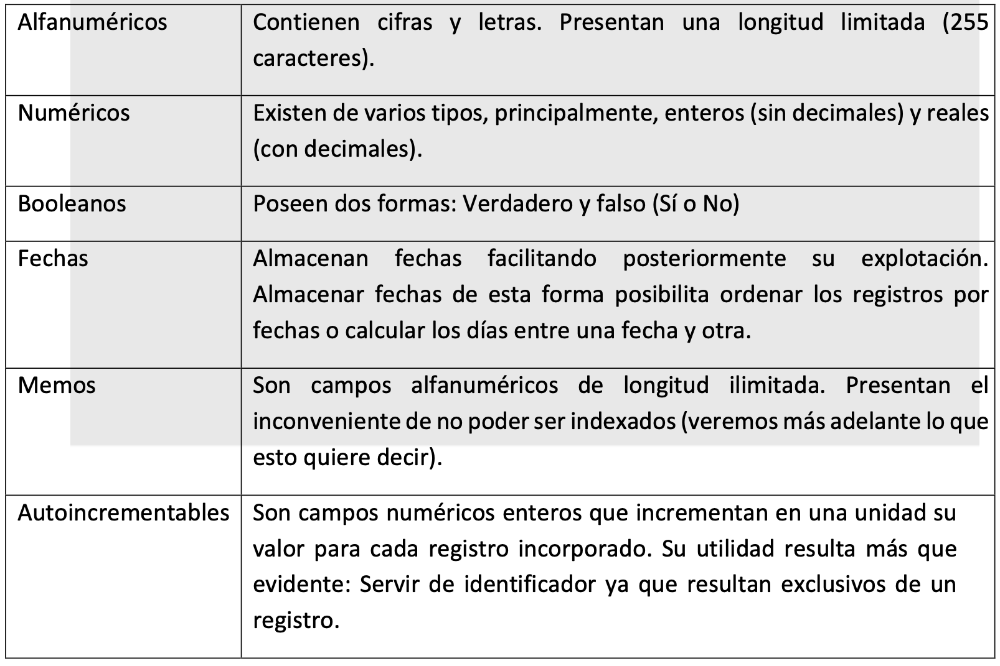
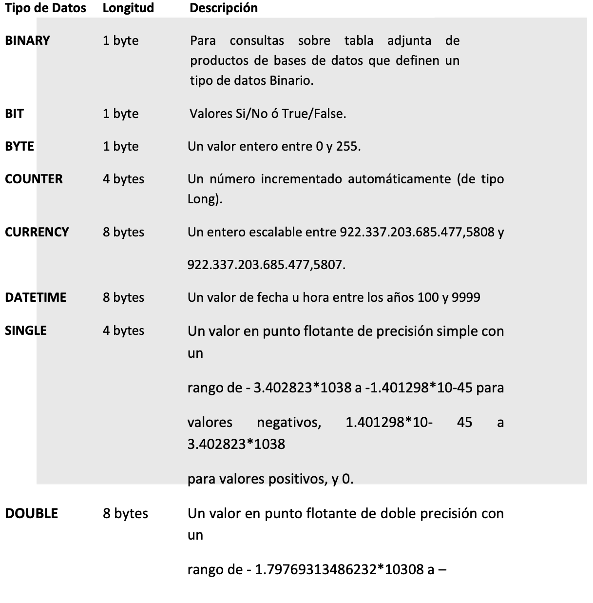
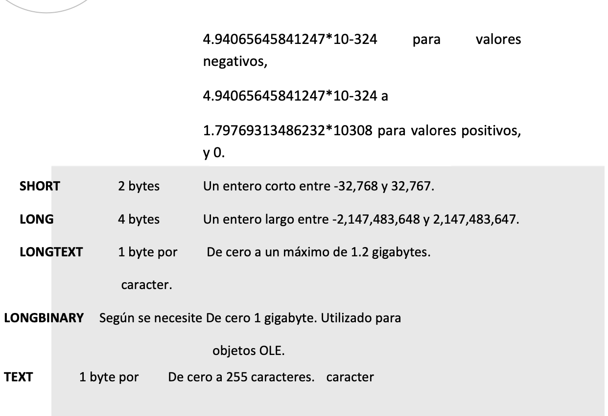
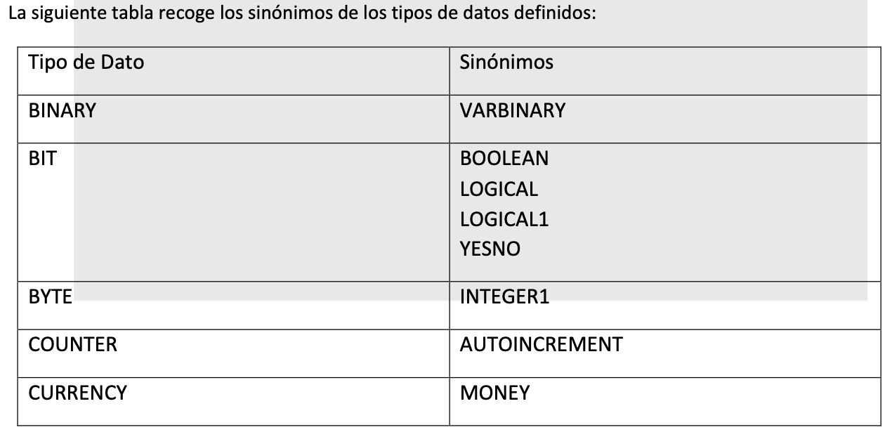
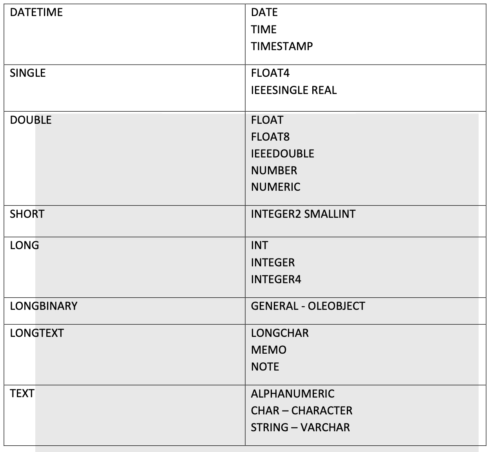

# Unidad 1
* ¿Qué son las bases de datos?
* Tipos de Bases de datos
* Funcionamiento de un Servidor SQL
* Motores de Almacenamiento MySQL
* Lenguaje SQL

# Que es una base de datos?
Es un sistema para archivar información en una computadora cuyo propósito general es mantener información y hacer que esté disponible cuando se la solicite.

Múltiples aplicaciones: bibliotecas, automatización de oficinas, diccionarios automatizados y en general cualquier programa orientado a mantener y recuperar información.

La diferencia entre un simple archivo de texto en donde guardamos los datos que nos interezan y una base de datos es que a este se le puede pedir datos, es como un almacen que permite guardar grandes cantidades de informacion de forma organizada para luego utilizarla y encontrarla facilmente.

Cada base de datos se compone de una o más tablas que guarda un conjunto de datos. Cada tabla tiene una o más columnas y filas. Las columnas guardan una parte de la información sobre cada elemento que queramos guardar en la tabla, cada fila de la tabla conforma un registro.

**Se define entonces brevemente a una base de datos como una serie de datos organizados y relacionados entre sí, los cuales son recolectados y explotados por los sistemas de información de una empresa o negocio en particular.**

# Caracteristicas 
### 1. Independencia lógica y física de los datos.
* Independencia Física de datos: Capacidad para modificar el esquema físico sin provocar que los programas de aplicación tengan que rescribirse. Las modificaciones en el nivel físico son ocasionalmente necesarias para mejorar el funcionamiento.
  
* Independencia Lógica de datos: Capacidad para modificar el esquema lógico sin causar que los programas de aplicación tengan que rescribirse. Las modificaciones en el nivel lógico son necesarias siempre que la estructura lógica de la base de datos se altere.

La independencia de datos lógica es más difícil de lograr que la independencia de datos física. Los progrmas de app son dependietes de los logicos.

### 2. Redundancia mínima.

Un buen diseño de una base de datos logrará evitar la aparición de información repetida o redundante.

### 3. Acceso concurrente por parte de múltiples usuarios.

**Un Sistema de Gestión de Base de Datos (SGBD)** debe controlar este acceso concurrente a la información, que podría derivar en inconsistencias. Lo mas habitual es que muchas personas accedan a un base de datos de forma simultanea por diferentes motivos.

### 4. Integridad de los datos.

Medidas necesarias para garantizar la validez de los datos almacenados. Es decir, se trata de proteger los datos ante fallos de hardware, datos introducidos por usuarios descuidados, o cualquier otra circunstancia capaz de corromper la información almacenada.

### 5. Consultas complejas optimizadas.
La optimización de consultas permite la rápida ejecución de las mismas.

### 6. Seguridad de acceso y auditoria.
La información almacenada en una base de datos puede llegar a tener un gran valor. Los SGBD deben garantizar que esta información se encuentra asegurada frente a usuarios malintencionados, que intenten leer información privilegiada; frente a ataques que deseen manipular o destruir la información; o simplemente ante las torpezas de algún usuario autorizado pero despistado.

Normalmente, los SGBD disponen de un complejo sistema de permisos a usuarios y grupos de usuarios, que permiten otorgar diversas categorías de permisos.

### 7. Respaldo y recuperación.
Los SGBD deben proporcionar una forma eficiente de realizar copias de seguridad de la información almacenada en ellos, y de restaurar a partir de estas copias los datos que se hayan podido perder.

### 8. Acceso a través de lenguajes de programación estándar.
Posibilidad de acceder a los datos de una base de datos mediante lenguajes de programación ajenos al sistema de base de datos propiamente dicho.

# Sistema de Gestión de Base de Datos (SGBD)
Los Sistemas de Gestión de Base de Datos (en inglés DataBase Management System) son un tipo de software muy específico, dedicado a servir de interfaz entre la base de datos, el usuario y las aplicaciones que la utilizan. Se compone de un lenguaje de definición de datos, de un lenguaje de manipulación de datos y de un lenguaje de consulta.

Se trata de un instrumento que nos permite ingresar, recuperar y manejar la información contenida en la base de datos:
1. Añadir nueva información a medida que ésta va ingresando.
2. Obtener la información ordenada según determinados parámetros (por orden alfabético, según
el nombre del autor, según la temática de cada libro, etc.).
3. Calcular cómputos referidos a la base (cantidad total de publicaciones, promedios periódicos
de ventas, promedios según las diversas categorías, etc.).
4. Imprimir la información deseada, ya sea en forma de tablas o de gráficos de diversos tipos.

### Diferencia con una base de datos tradicional 
Esta diferencia consiste en que los datos se ingresan una sola vez, de una determinada forma, y pueden luego manipularse para extraer la información ordenada y seleccionada según múltiples criterios.

# Ventajas y desventajas  de la utilizacion de Base de Datos

### Ventajas
1. Control sobre la redundancia de datos
2. Consistencia de datos
3. Compartición de datos
4. Mantenimiento de estándares
5. Mejora en la integridad de datos
6. Mejora en la seguridad
7. Mejora en la accesibilidad a los datos
8. Mejora en la productividad
9. Mejora en el mantenimiento
10. Aumento de la concurrencia
11. Mejora en los servicios de copias de seguridad

### Desventajas
1. Complejidad
2. Coste del equipamiento adicional
3. Vulnerable a los fallos

# Tipos de base de datos 
Se utilizan para describir datos en los niveles conceptual y físico. Estos modelos utilizan registros e instancias para representar la realidad, así como las relaciones que existen entre estos registros (ligas) o apuntadores. A diferencia de los modelos de datos basados en objetos, se usan para especificar la estructura lógica global de la base de datos y para proporcionar una descripción a nivel más alto de la implementación.

Entre las más utilizadas podemos mencionar las siguientes:
* Relacionales
* Orientadas a Objetos 
* Lógicas

El único tipo que realmente se usa en las aplicaciones son las Bases de Datos Relacionales. La no utilización de los otros dos tipos se debe a cuestiones avanzadas de programación porque el desarrollo de programas con ellas es muy complicado.

### Bases de Datos Relacionales
La ventaja del modelo relacional es que los datos se almacenan, al menos conceptualmente, de un modo en que los usuarios entienden con mayor facilidad. Los datos se almacenan como tablas y las relaciones entre las filas y las tablas son visibles en los datos. Este enfoque permite a los usuarios obtener información de la base de datos sin asistencia de sistemas profesionales de administración de información.

### Las características más importantes de los modelos relacionales son:
1. Las entradas en la tabla tienen un solo valor (son atómicos); no se admiten valores múltiples, por lo tanto la intersección de un renglón con una columna tiene un solo valor, nunca un conjunto de valores.
2. Todas las entradas de cualquier columna son de un solo tipo. 
3. No existen 2 filas en la tabla que sean idénticas.
4. La información en las bases de datos son representados como datos explícitos, no existen apuntadores o ligas entre las tablas.

En el enfoque relacional, los datos se organizan en tablas llamadas relaciones, cada una de las cuales se implanta como un archivo. En terminología relacional una fila en una relación representa un registro o una entidad; Cada columna en una relación representa un campo o un atributo.

Para resumir, en este tipo de bases de datos hay varios elementos que hay que tener en cuenta:
* Tablas
* Columnas o campos
* Filas o registros
* Valores
* Campos Llave
* Relaciones
* Esquemas

### Tablas 
Las bases relacionales se componen de relaciones, más comúnmente llamadas tablas.

Una tabla es lo que su nombre indica, un cuadro de doble entrada en el cual se relacionan datos. Es bastante parecido a cuando uno guarda información en una planilla de cálculo: allí también lo hace en tablas compuestas por Columnas y Filas.

### Columnas o campos
Cada columna dentro de una tabla tiene un nombre único y almacenan diferente información cada una.

Además, cada Columna (también denominadas Campo) tiene asociado un Tipo de Dato.

Es lo mismo que las variables, si vamos a almacenar texto en un campo, tiene que ser un campo de tipo texto. En cambio si queremos almacenar un número, tendremos que usar un campo de tipo numérico.

### Filas o registros
Como las filas dependen de una tabla, todas van a tener la misma estructura pero contenidos diferentes entre sí.

### Valores
Cada fila consiste de un grupo de valores, los cuales corresponden a cada una de las columnas. Como cada uno corresponde a una columna, su tipo de dato es el indicado por la columna en cuestión.

### Llaves
Como dijimos antes, cada registro (o fila) tiene que tener información diferente, porque dos registros iguales serían generar datos de más en la BD. Ahora bien, tenemos que tener una manera de seleccionar solamente a un registro específico.

## Peligros en el diseño de bases de datos relacionales.
Uno de los retos en el diseño de la base de datos es el de obtener una estructura estable y lógica tal que:
* El sistema de base de datos no sufra de anomalías de almacenamiento.
* El modelo lógico pueda modificarse fácilmente para admitir nuevos requerimientos.

Una base de datos implantada sobre un modelo bien diseñado tiene mayor esperanza de vida aun en un ambiente dinámico, que una base de datos con un diseño pobre. En promedio, una base de datos experimenta una reorganización general cada seis años, dependiendo de lo dinámico de los requerimientos de los usuarios. Una base de datos bien diseñada tendrá un buen desempeño aunque aumente su tamaño, y será lo suficientemente flexible para incorporar nuevos requerimientos o características adicionales.

Existen diversos riesgos en el diseño de las bases de datos relacionales que afecten la funcionalidad de la misma, los riesgos generalmente son la redundancia de información y la inconsistencia de datos.

### La normalización
Es el proceso de simplificar la relación entre los campos de un registro.
Por medio de la normalización un conjunto de datos en un registro se reemplaza por varios registros que son más simples y predecibles y, por lo tanto, más manejables. La normalización se lleva a cabo por cuatro razones:

* Estructurar los datos de forma que se puedan representar las relaciones pertinentes entre los datos.
* Permitir la recuperación sencilla de los datos en respuesta a las solicitudes de consultas y reportes.
* Simplificar el mantenimiento de los datos actualizándolos, insertándolos y borrándolos.
* Reducir la necesidad de reestructurar o reorganizar los datos cuando surjan nuevas aplicaciones.

En términos más sencillos la normalización trata de simplificar el diseño de una base de datos, esto a través de la búsqueda de la mejor estructuración que pueda utilizarse con las entidades involucradas en ella.

# FUNCIONAMIENTO DE UN SERVIDOR MYSQL
1. Los clientes se conectan a servidor.
   
2. Los clientes inician autentificación, codifican y envían peticiones, comprimen y cifran peticiones, cachean los resultados del servidor.
3. El servidor procesa las peticiones y devuelve las respuestas.
4. Las peticiones son procesadas primero por la capa de manipulación, que las desencripta, valida su sintaxis, las busca en la caché, y las envía al correspondiente motor de almacenamiento.
5. Los motores de almacenamiento (MyISAM, InnoDB, Memory) manejan la representación en memoria y disco de bases de datos, tablas e índices, así como generación de estadísticas y algunos logs.
6. La capa de manejo escribe logs a disco, guarda y lee caches en memoria, lee logs binarios de la red. Los motores de almacenamiento guardan datos (tablas, logs, etc) en disco y en memoria, envía datos a otros servidores remotos.

### El servidor MySQL utiliza espacio en disco para almacenar lo siguiente:
* Los programas cliente y servidor, y sus librerías. 
    *  Los ficheros de registro ("logs") y de estado. o Las bases de datos.
* Los ficheros de formato de tablas ('*.frm') para todos los motores de almacenamiento, y los ficheros de datos y ficheros de índices para algunos motores de almacenamiento.
* Los ficheros de "tablespaces" de InnoDB, si el motor de almacenamiento InnoDB está activado. 
   * Tablas temporales internas que han sobrepasado el límite de tamaño en memoria y deben ser convertidas a tablas en disco.

### El servidor MySQL utiliza espacio en memoria para almacenar lo siguiente:
* Gestores de conexión (cada conexión consume memoria).
  
* Buffers que guardan tablas temporales internas que no han sobrepasado el límite de tamaño
en memoria.
* Cachés: caché de hosts, la caché de tablas, la caché de consultas, etc. o Una copia de la tabla
de permisos.
* El contenido de las tablas HEAP (motor de almacenamiento en memoria). Su fichero de
formato ('*.frm') se continua guardando en disco.

### El servidor MySQL utiliza los siguientes buffers por cada cliente:
* Buffers de registros para las búsquedas secuenciales en tablas ('read_buffer_size') y para leer
las líneas después de una ordenación ('read_rnd_buffer_size') normalmente conseguida
mediante la cláusula ORDER.
* Buffer de join para las uniones de tablas.
* Buffer de ordenación para las operaciones de ordenación.
* Buffer de comunicaciones para intercambiar información con el cliente.

Comienza con un tamaño de 'net_buffer_length', pero si es necesario el servidor aumenta su tamaño al señalado por 'max_allowed_packet'.

### Los límites que el sistema operativo puede imponer al servidor MySQL son:
* El máximo número de ficheros abiertos por proceso limita el tamaño máximo de la caché de
tablas, que guarda los descriptores de ficheros para los ficheros de tablas.
* El máximo número de hilos de ejecución por proceso limita el número de clientes que se pueden conectar simultáneamente al servidor MySQL.
* El 'backlog' permitido por el sistema limita el número de conexiones de red en cola debido a clientes que esperan a conectarse.
* El sistema de ficheros donde se guardan los datos limita el tamaño máximo del fichero, pero este límite puede esquivarse repartiendo los datos en varios ficheros.

# MOTORES DE ALMACENAMIENTO DE MYSQL Y TIPOS DE TABLAS
El servidor MySQL incorpora una característica única llamada "motores de almacenamiento", que nos permite seleccionar el tipo de almacenamiento interno de cada tabla, en base al que mejor se adecúe a una situación particular. Dicha selección, la hace el desarrollador a nivel de tabla, y no afecta a la manera en que el servidor interactúa con el cliente: los comandos SQL serán los mismos sea cual sea el motor de almacenamiento escogido. El cliente no necesita saber cómo se guardan los datos.
* Muy rápido en lectura y escritura (excepto escrituras simultáneas en la misma tabla). o Bajo requerimiento de espacio en disco y memoria.
* Los datos se guardan en disco: diferentes ficheros para la definición de la tabla, los datos y los índices.
* Es el motor por defecto de MySQL.
* Es una buena elección cuando necesitamos velocidad, y tenemos pocas modificaciones
simultáneas de la tabla.

### Características del motor InnoDB:
* Transaccional.
* Multiversionado: cuando múltiples transacciones modifican registros, InnoDB mantiene aisladas las transacciones guardando para cada una de ellas una versión distinta de un mismo registro, a cada transacción la versión que le corresponde.
* Bloqueos a nivel de registro. o Restricciones en claves foráneas. o Fácil recuperación de datos en caso de error. o Alta concurrencia más segura en escritura. o Deshacer transacciones a medias ("rollback").
* Los datos se guardan en disco: un fichero para la definición de la tabla, y un "tablespace" para guardar conjuntamente datos e índices. El tablespace puede consistir en uno o más ficheros, o incluso una partición entera en disco. o Podemos especificar cómo crecen los tablespaces en el fichero de configuración /etc/mysql/my.cnf.
* Necesita más espacio en disco y memoria que MyISAM para guardar los datos (unas tres veces más de espacio en disco, y montones de RAM para las memorias temporales si queremos conseguir un rendimiento óptimo).
* Es una buena elección cuando necesitamos transacciones,
restricciones en claves foráneas, o tenemos muchas escrituras simultáneas.

###  Características del motor HEAP ( o MEMORY):
* Los datos se guardan en memoria, utilizando algoritmos que hacen un uso óptimo de este medio. 
*  Es muy rápido. 
*  Podemos crear una tabla HEAP a partir de una tabla en disco.
* Es una buena elección cuando necesitamos realizar operaciones muy rápidas sobre conjuntos pequeños de datos.

### Características del motor NDB:
*  Es el motor de almacenamiento de los clúster de MySQL.
* La base de datos está repartida por los diferentes nodos del clúster. o Proporciona alta
disponibilidad mediante redundancia.
* Proporciona alto rendimiento mediante fragmentación de datos sobre los grupos de nodos.
* Proporciona alta escalabilidad mediante la combinación de las dos características anteriores.
* Los datos se guardan en memoria, pero los logs van a disco.
* Es una buena elección cuando disponiendo de varios servidores necesitamos a la vez velocidad, transacciones y redundancia de datos; replicación síncrona; y resistencia a caídas de servidores.

# LLAVES O CLAVES PRIMARIAS Y LLAVES O CLAVES FORÁNEAS
Dentro de los campos llave, podemos diferenciar dos tipos:
### 1. Primarias
 Una clave primaria es un campo (o varios) que identifica unívocamente 1 solo registro (fila) en una tabla. Para un valor del campo clave existe solamente 1 registro. Los valores no se repiten ni pueden ser nulos.

Una tabla sólo puede tener una clave primaria. Cualquier campo (de cualquier tipo) puede ser clave primaria, debe cumplir como requisito, que sus valores no se repitan.

Al establecer una clave primaria estamos indexando la tabla, es decir, creando un índice para dicha tabla; a este tema lo veremos más adelante.
### 2. Foráneas
Son campos llave que permiten referenciar unívocamente a un registro que está dentro de otra tabla.
 Por ejemplo: 
 En el caso de la tabla “Ordenes”:

**nro_pedido es una Llave Primaria**

En este caso, el campo llave identifica a cada orden de compra, por lo tanto es para registros que están dentro de la tabla.

**nro_cliente es una Llave Foránea**

En cambio este campo se usa para saber qué cliente es el que realizó la orden de compra, es decir, nos sirve para identificar sin lugar a dudas el cliente de entre todos los de la tabla “Clientes”.

### Integridad referencial

La integridad referencial se refiere a las claves foráneas. Recordemos que una clave foránea es un atributo de una relación, cuyos valores se corresponden con los de una clave primaria en otra o en la misma relación. Este mecanismo se usa para establecer interrelaciones.

La integridad referencial consiste en que si un atributo o conjunto de atributos se define como una clave foránea, sus valores deben existir en la tabla en que ese atributo es clave principal.

### Esquemas
El conjunto de todos los diseños de las tablas de una BD se llama Esquema. Vendría a ser algo así como un plano de la Base. En el Esquema de la BD se muestran todas las tablas, junto con sus campos y llaves primarias y/o foráneas.

# TIPOS DE CAMPO
Como sabemos una base de datos está compuesta de tablas donde almacenamos registros catalogados en función de distintos campos.

Un aspecto previo a considerar es la naturaleza de los valores que introducimos en esos campos. Dado que una base de datos trabaja con todo tipo de informaciones, es importante especificarle qué tipo de valor le estamos introduciendo de manera a, por un lado, facilitar la búsqueda posteriormente y por otro, optimizar los recursos de memoria.

Cada base de datos introduce tipos de valores de campo que no necesariamente están presentes en otras. Sin embargo, existe un conjunto de tipos que están representados en la totalidad de estas bases. Estos tipos comunes son los siguientes:

### Tipos de datos SQL
Los tipos de datos SQL se clasifican en 13 tipos de datos primarios y de varios sinónimos válidos reconocidos por dichos tipos de datos. Los tipos de datos primarios son:

# UN VISTAZO AL SQL
Structured Query Language que no es más que un lenguaje estándar de comunicación con bases de datos. Hablamos por tanto de un lenguaje normalizado que nos permite trabajar con cualquier tipo de lenguaje (ASP o PHP) en combinación con cualquier tipo de base de datos (MS Access, SQL Server, MySQL...).

El hecho de que sea estándar no quiere decir que sea idéntico para cada base de datos.
En efecto, determinadas bases de datos implementan funciones específicas que no tienen necesariamente que funcionar en otras.

Aparte de esta universalidad, el SQL posee otras dos características muy apreciadas. Por una parte, presenta una potencia y versatilidad notables que contrasta, por otra, con su accesibilidad de aprendizaje.

**MySQL es un sistema de gestión de bases de datos.**

Una base de datos define una estructura en la cual se guardará información. Los datos se guardan en tablas, en las cuales cada columna define el tipo de información que se guardará en ella y cada fila es un registro de la tabla. Cada base de datos tiene un nombre identificador, sus tablas tienen un nombre que las distingue y cada columna de una tabla tiene un tipo de dato asociado (por ejemplo, VARCHAR para cadenas de caracteres, INT para números enteros, etc).
El proceso de datos de las bases de datos se hace a través de consultas.
