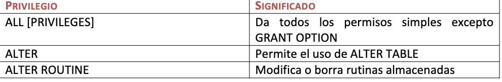
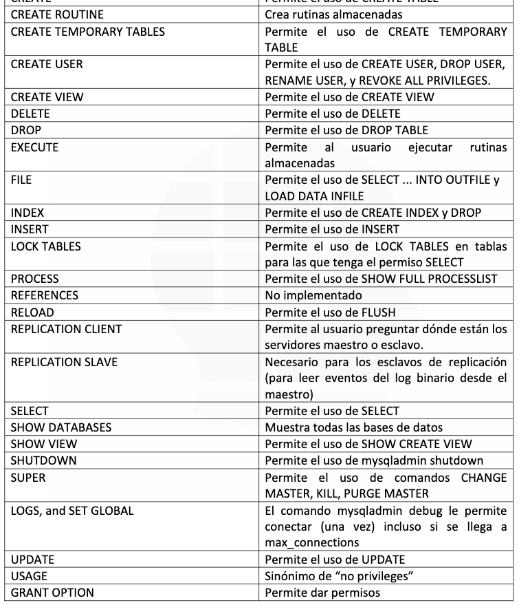
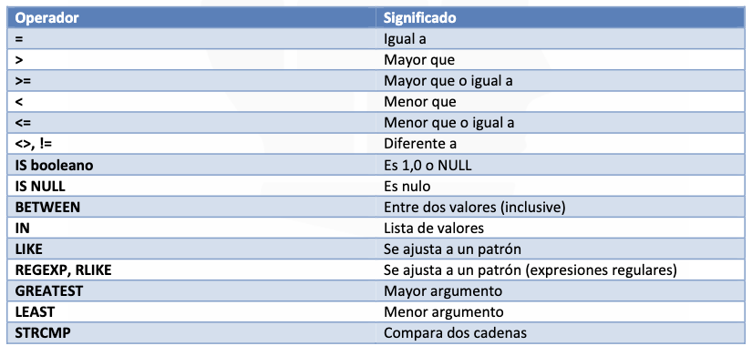

# DCL (DATA CONTROL LAGUAGE)
Un `Lenguaje de Control de Datos` (DCL por sus siglas en inglés: Data Control Language) es un lenguaje proporcionado por el Sistema de Gestión de Base de Datos que incluye una serie de comandos SQL que permiten al administrador controlar el acceso a los datos contenidos en la Base de Datos.

Las tareas sobre las que se pueden conceder o denegar permisos son las siguientes: 
* CONNECT 
* SELECT 
* INSERT 
* UPDATE 
* DELETE 
* USAGE 

Características: 
* Garantiza la seguridad de nuestros datos. 
* Previene el acceso ilegal a nuestros datos. 
* Monitorea el acceso a nuestros datos. 
* Específica a cada usuario lo que puede realizar en nuestra base de datos. 
 
Como podemos notar por medio de  este lenguaje ofrecemos seguridad a la administración de  nuestras bases 
de datos, este lenguaje en MySQL está conformado por dos comandos cuya sintaxis mostraremos a 
continuación: 

### **1.- GRANT:** 
Se utiliza para darle permisos a un usuario en nuestra base de datos la sintaxis es la siguiente. 
GRANT privilegios ON basededatos.tabla TO usuario IDENTIFIED BY 'contraseña del usuario'; 

Donde los privilegios pueden ser: 

Además de los privilegios vemos que debemos indicar la base de datos sobre la cual se le otorgan los privilegios 
al usuario, si se coloca el * el cual es el selector universal se indica que sobre todas, tendremos varios casos: 

1.   El  asterisco  punto  asterisco  solo:  Indicaríamos  que  el  usuario  tiene  el  privilegio  indicado  sobre  todas  las 
tablas y todas las bases de datos. Ejemplo: 
* GRANT ALL PRIVILEGES ON *.* TO usuario IDENTIFIED BY 'contraseña'; 
2.   Nombre  de  la  base  de  datos  seguido  de  punto(.)  asterisco  (*):  Indicamos  todas  las  tablas  de  esa  base  de 
datos. 
* GRANT ALL PRIVILEGES ON base_datos.* TO usuario IDENTIFIED BY 'contraseña'; 
3. Nombre de la base de datos seguido de punto(.) y nombre de la tabla: Indicamos a cual tabla en especifica se 
le darán los privilegios indicados. 
 * GRANT ALL PRIVILEGES ON base_datos.tabla TO usuario IDENTIFIED BY 'contraseña'; 
 * 
Como  se  puede  ver  con  el  GRANT  otorgamos  privilegios  a  los  usuarios  desde  nuestro  usuario  administrador 

ROOT de manera que solo tengan acceso a lo que el administrador del sistema indique. 
### 2.-  REVOKE:  
Es  utilizado  para  quitarle  o  revocar  los  privilegios  de  un  usuario  en  nuestras  base  de  datos,  la sintaxis es la siguiente: 

* REVOKE privilegios ON basedatos FROM usuario; 

Donde  los  privilegios  son  igual  que  los  establecidos  en  la  tabla  anterior,  y  la  base  de  datos  igualmente  se  le indica de la manera que se indicó con el GRANT. 

Como podemos observar el lenguaje DCL es importante en la Administración de nuestras base de datos ya que nos ayuda a mantenerlas seguras y tener control total sobre lo que los usuarios pueden o no hacer dentro de ella. 
  
### OPERADORES

**Operadores de comparación**

Los  operadores  de  comparación,  son  aquellos  destinados  a  comparar  dos  expresiones  o  valores  y  que  tienen como resultado un valor booleano, ya sea 1 (true) ó 0 (false) aunque también puede devolver NULL. 

Los operadores de comparación se suelen utilizar en la cláusula WHERE con la siguiente sintaxis: 

* SELECT campo1, campo2, ... FROM tabla, ... WHERE expresión1 OPERADOR expresión2; 

 A continuación una tabla de los operadores y funciones de comparación con los que trabajaremos

**Igual a (=)**

Este  operador  compara  las  dos  expresiones  o  valores  y  nos  devuelve  como  resultado:  1  (true)  si  las  dos expresiones o valores son iguales ó 0 (false) si las dos expresiones o valores son diferentes entre ellas. 
Se utiliza con el símbolo "=".    

* SELECT * FROM tabla WHERE campo = 1; 
* 
En esta sentencia se seleccionará todos los campos (*) de tabla donde la comparación de campo = 1 sea cierta. 
* SELECT * FROM tabla WHERE campo = 'Juan'; 

Aquí la sentencia selecciona todos los campos (*) de tabla donde campo tenga el valor de 'Juan'. 

**Mayor que (>)** 

Éste también compara las dos expresiones o valores, pero nos dará como resultado 1 (true) cuando el valor de la  primera  expresión  sea  mayor  que  el  valor  de  la  segunda  expresión  y  nos  dará  como  resultado  0  (false) cuando  el  valor  de  la  primera  expresión  sea  menor  que  el  valor  de  la  segunda  expresión.

  También  nos  dará como resultado 0 (false) cuando los valores de las dos expresiones sean iguales. 

* SELECT * FROM tabla WHERE campo > 12; 

La sentencia anterior nos devolverá todos los campos (*) de tabla donde campo sea mayor que 12. 
* SELECT * FROM tabla WHERE campo > 'a'; 

Ésta nos devuelve todos los campos (*) de tabla donde campo sea mayor que 'a

**Mayor que o igual a (>=)**

Cuando los valores de las dos expresiones son iguales en lugar de devolver 0 (false), devuelve 1 (true). 
* SELECT * FROM tabla WHERE campo >= 9; 
  
En  esta  sentencia  se  seleccionan  todos  los  campos  (*)  de  tabla  donde  el  valor  de  campo  sea  mayor  que  9  o igual a 9. 
* SELECT * FROM tabla WHERE campo >= 'B'; 
* 
En  esta  sentencia  se  seleccionan  todos  los  campos  (*)  de  tabla  donde  el valor de  campo  sea  mayor  que  'B' o igual a 'B'. 

**Menor que (<)**

Compara las dos expresiones o valores y de esta comparación obtendremos como resultado: 1 (true) si el valor de la primera expresión es menor al valor de la segunda expresión, 0 (false) si el valor de la primera expresión es mayor al valor de la segunda expresión y si los valores de las dos expresiones son coincidentes. 
* SELECT * FROM tabla WHERE campo < 27; 
  
Con esta sentencia seleccionamos todos los campos (*) de tabla donde el valor de campo sea menor que 27. 
* SELECT * FROM tabla WHERE campo < 'c'; 
  
Ésta selecciona todos los campos (*) de tabla donde el valor de campo sea menor que 'c'. 

**Menor que o igual a (<=)**

Cuando los valores de las dos expresiones son iguales en lugar de devolver 0 (false), devuelve 1 (true).  
* SELECT * FROM tabla WHERE campo <= 5; 
  
En  esta  sentencia  se  seleccionan  todos  los  campos  (*)  de  tabla  donde  el  valor  de  campo  sea  menor  que  5  o igual a 5. 
* SELECT * FROM tabla WHERE campo <= 'B'; 

Y en esta sentencia se seleccionan todos los campos (*) de tabla donde el valor de campo sea menor que 'B' o igual a 'B' 

**Diferente a (<>, !=)** 

Este operador se utiliza para saber si una expresión o valor es diferente a la otra expresión o valor. El resultado de  la  comparación  con  el  operador  "Diferente  a"  (<>,!=)  nos  devolverá:  1  (true)  cuando  las  expresiones  sean diferentes, es decir no coincidan; y nos devolverá 0 (false) cuando las expresiones coincidan. 
* SELECT * FROM tabla WHERE campo <> 'Pedro'; 
  
Con esta sentencia seleccionamos todos los campos (*) de tabla donde el valor de campo sea diferente al literal 'Pedro'. 
* SELECT * FROM tabla WHERE campo != 10; 

Y con esta otra, seleccionamos todos los campos (*) de tabla donde el valor de campo sea diferente a 10.

**IS**

Con el operador "IS" lo que hacemos es comparar una expresión o valor con un valor booleano, el cual puede 
ser TRUE (verdadero), FALSE (falso) o UNKNOWN. 

**IS TRUE** 

"IS TRUE", con este operador junto al booleano 'TRUE' comparamos que la expresión o valor sea 'TRUE', dando como  resultado  1  (true)  si  la  expresión  o  valor  es  'TRUE'  y  como  resultado  0  (false)  si  la  expresión  o  valor  es 'FALSE' o 'NULL'. Ejemplo: 
* SELECT * FROM tabla WHERE campo IS TRUE; 

Esta sentencia nos seleccionará todos los campos (*) de tabla donde campo sea cierto

**IS FALSE** 
"IS  FALSE",  es  el  antónimo  de  "IS  TRUE".  Este  operador  compara  que  la  expresión  o  valor  sea  'FALSE',  dando como  resultado 1  (true)  si la  expresión  o valor es  'FALSE'  y  como  resultado 0  (false)  si  la  expresión o  valor  es 'TRUE' o 'NULL'. Ejemplo: 
* SELECT * FROM tabla WHERE campo IS FALSE; 

Esta sentencia nos seleccionará todos los campos (*) de tabla donde campo sea falso. 

**IS NULL** 
Con  el  operador  "IS  NULL"  comparamos  que  la  expresión  o  valor  sea  nula,  dando  como  resultado  1  (true)  en caso de que sí sea nula ó 0 en caso de que la expresión o valor no sea nula. Ejemplo: 
* SELECT * FROM tabla WHERE campo IS NULL; 

Esta sentencia nos seleccionará todos los campos (*) de tabla donde campo sea nulo.

**BETWEEN**

Ahora  toca  este  operador  que  es  bastante  conocido  también  y  es  BETWEEN,  se  utiliza  para  comparar  una 
expresión  o  valor  con  un  rango  de  valores  inclusive  los  valores  que  limitan  este  rango.  La  comparación  con BETWEEN devuelve 1 (true) cuando la expresión o valor están dentro del rango y devuelve 0 (false) cuando no lo están.  
* BETWEEN valor_mínimo AND valor_máximo; 
  
Ejemplo: 
* SELECT * FROM tabla WHERE campo BETWEEN 10 AND 20; 

Seleccionamos todos los campos (*) de tabla donde campo esté entre 10 y 20 ambos incluidos.

**LIKE**

LIKE  también  es  una  función  de  comparación  entre  una  cadena  de  caracteres  y  un  patrón  que  nosotros imponemos.  Esta  función  es  bastante  utilizada  por  la  sencillez  de  sólo  tener  2  comodines  (%,_).  Devuelve  1 (true)  cuando  la  cadena  de  caracteres  comparada  se  rige  por  el  patrón  impuesto  y  devuelve  0  cuando  no  lo hace.  

* SELECT * FROM tabla WHERE campo LIKE 'Pe%\_dro'; 
* SELECT * FROM tabla WHERE campo LIKE 'Pe%._dro' ESCAPE '.'; 

En  ambas  sentencias  seleccionamos  todos  los  campos  de  tabla  cuando  campo  se  rija  con  el  patrón.  En  la primera  sentencia  utilizamos  el  carácter  de  escape  por  defecto  que  es  '\'  y  en  la  segunda  sentencia  le indicamos cual queremos que sea nuestro carácter de escape, en este caso '.'. 

**Comodines**
Para que el patrón del LIKE sea más efectivo existen dos tipos de comodines como ya hemos dicho antes: Uno de  ellos  es  el  símbolo  de  porcentaje  (%),  el  cual  representa  a  cualquier  secuencia  de  cero  o  más  caracteres. 

También está el comodín (_), que éste representa a un solo carácter.

**REGEXP, RLIKE**

Una  función  muy  parecida  a  LIKE  pero  en  lugar  de  utilizar  los  comodines  %  y  _,  se  utilizan  expresiones regulares.  Esta  función  se  puede  llamar  de  dos  formas:  REGEXP  o  RLIKE,  es  indiferente  cual  se  utilice  pues  la función es la misma. Devuelve 1 si la cadena de caracteres a comparar coincide con el patrón y 0 sino coincide. 

También dará como resultado NULL si la cadena que queremos comparar es NULL.  Un ejemplo de REGEXP: 
* SELECT 'hola' REGEXP 'ˆ[h-z]*' 
* 
La SELECT nos devolverá 1 ya que la cadena coincide con el patrón. No explico más sobre esta función porque no entiendo de expresiones regulares, era para dar una idea de que también se podían utilizar en MySQL.

### Comando basicos para agregar datos
* INSERT INTO usuarios VALUES (DEFAULT, 'Alfredo', 'Lonn', 'Twitter', 52, 'alfredlonn@gmail.com');

### Comando basico para axtualizar/cambiar datos
* UPDATE usuarios SET correo = 'juanafernadez@hotmail.com' WHERE correo = 'juanafer@hotmail.com'

* UPDATE usuarios SET correo = 'juanafernadez@hotmail.com' WHERE id_us = 6 

