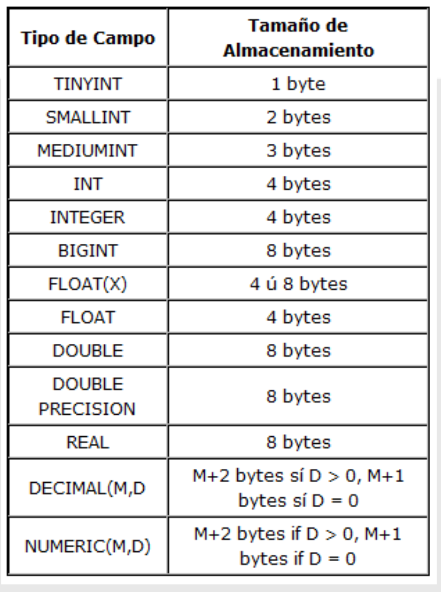
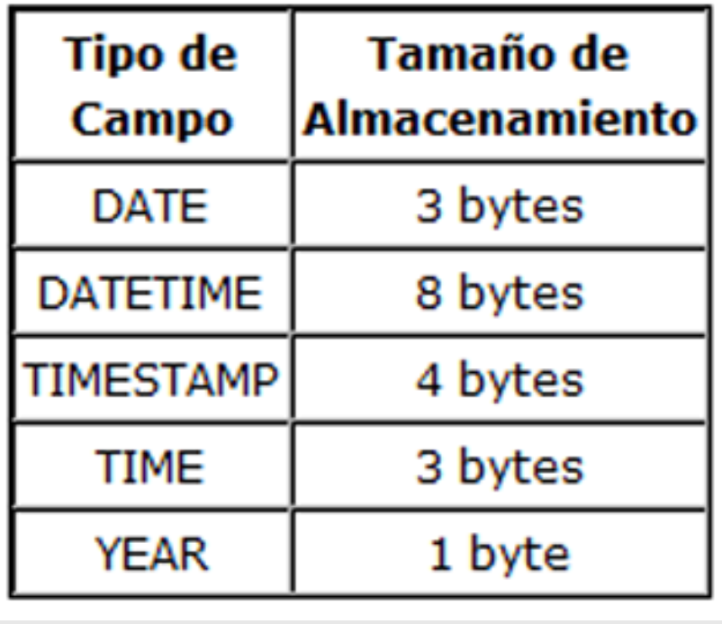
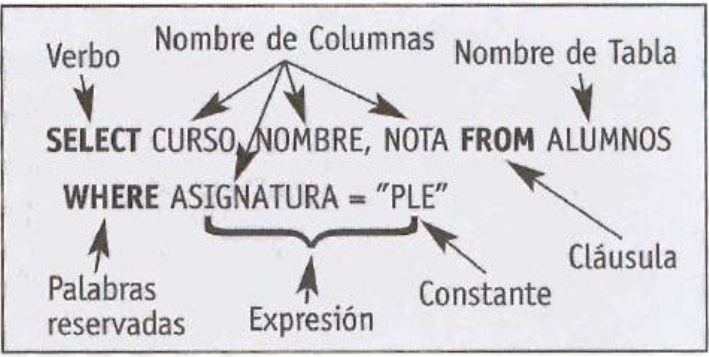

# Introduccion a MySQL

### Tipos de campos 
Podemos agrupar los tipos de datos en las siguientes categorías: de caracteres, enteros, de coma flotante, tiempos, bloques, enumerados y conjuntos.

**Parámetros**

Se define entonces brevemente a una base de datos como una serie de datos organizados y relacionados entre sí, los cuales son recolectados y explotados por los sistemas de información de una empresa o negocio en particular.

* M:  Este parámetro se utiliza para indicar el número máximo de caracteres que pueden tener los valores que incluyamos en esta columna. M puede ser cualquier número entero entre 1 y 255.
* D: Este parámetro nos permite especificar cuántos números decimales pueden ser almacenados en valores de punto flotante. El máximo valor de este es 30, siempre y cuando el parámetro M nos lo permita.

**Atributos**
* ZEROFILL: Esta opción consigue que la columna siempre ocupe su máxima longitud, dado que en el caso de que no le asignemos ningún valor, el sistema automáticamente lo completará con ceros.
* UNSIGNED: Esta opción consigue que la columna sólo acepte valores positivos, o cero. Hayque tener precaución y, antes de activarla, tener completamente seguro que no queremos aceptar valores negativos.
* BINARY: Por defecto, los caracteres de comparación en MySQL no distinguen entre mayúsculas y minúsculas. Sin embargo, los caracteres de comparación en columnas BINARY sí admiten mayúsculas y minúsculas.

### Tipos de datos de cadenas de caracteres

**CHAR**

Es un sinónimo de CHAR(1), y puede contener un único carácter.

* CHAR(M) [BINARY | ASCII | UNICODE]:
  
Contiene una cadena de longitud constante. Para mantener la longitud de la cadena, se rellena a la derecha con espacios. Estos espacios se eliminan al recuperar el valor. Los valores válidos para M son de 0 a 255, y de 1 a 255 para versiones de MySQL previas a 3.23. 

**VARCHAR()**

* VARCHAR(M) [BINARY]:

Contiene una cadena de longitud variable. Los valores válidos para M son de 0 a 255, y de 1 a 255 en versiones de MySQL anteriores a 4.0.2. Los espacios al final se eliminan.

Si no se especifica la palabra clave BINARY estos valores se ordenan y comparan sin distinguir mayúsculas y minúsculas. VARCHAR es un alias para CHARACTER

### Tipos de datos enteros 
**TINYINT**

* TINYINT[(M)] [UNSIGNED] [ZEROFILL]
Contiene un valor entero muy pequeño. El rango con signo es entre -128 y 127. El rango sin singo, de 0 a 255. BIT, BOOL y BOOLEAN, todos son sinónimos de TINYINT(1).

**SMALLINT**
* SMALLINT[(M)] [UNSIGNED] [ZEROFILL]

Contiene un entero corto. El rango con signo es de -32768 a 32767. El rango sin singo, de 0 a 65535.

**MEDIUMINT**
* MEDIUMINT[(M)] [UNSIGNED] [ZEROFILL]
  
Contiene un entero de tamaño medio, el rango con signo está entre -8388608 y 8388607. El rango sin signo, entre 0 y 16777215.

**INT**
* INT[(M)] [UNSIGNED] [ZEROFILL]
  
Contiene un entero de tamaño normal. El rango con signo está entre -2147483648 y 2147483647. El rango sin singo, entre 0 y 4294967295.

**INTEGER**
* INTEGER[(M)] [UNSIGNED] [ZEROFILL]

Es sinónimo de INT.

**BIGINT**
* BIGINT[(M)] [UNSIGNED] [ZEROFILL]
  
Contiene un entero grande. El rango con signo es de -9223372036854775808 a 9223372036854775807. El rango sin signo, de 0 a 18446744073709551615.

### Tipos de datos en coma flotante 

**FLOAT**
* FLOAT(precision) [UNSIGNED] [ZEROFILL]

Contiene un número en coma flotante, precisión puede ser menor o igual que 24 para números de precisión sencilla y entre 25 y 53 para números en coma flotante de doble precisión. Estos tipos son idénticos que los tipos FLOAT y DOUBLE descritos a continuación. FLOAT(X) tiene el mismo rango que los tipos FLOAT y DOUBLE correspondientes, pero el tamaño mostrado y el número de decimales quedan indefinidos.

**FLOAT()**
* FLOAT[(M,D)] [UNSIGNED] [ZEROFILL]
  
Contiene un número en coma flotante pequeño (de precisión sencilla). Los valores permitidos son entre - 3.402823466E+38 y -1.175494351E-38, 0, y entre 1.175494351E- 38 y 3.402823466E+38. Si se especifica el modificador UNSIGNED, los valores negativos no se permiten. El valor M es la anchura a mostrar y D es el número de decimales. Si se usa sin argumentos o si se usa FLOAT(X), donde X sea menor o igual que 24, se sigue definiendo un valor en coma flotante de precisión sencilla.

**DOUBLE**
* DOUBLE[(M,D)] [UNSIGNED] [ZEROFILL]

Contiene un número en coma flotante de tamaño normal (precisión doble). Los valores permitidos están entre -1.7976931348623157E+308 y -2.2250738585072014E-308, 0, y entre 2.2250738585072014E-308 y 1.7976931348623157E+308. Si se especifica el modificador UNSIGNED, no se permiten los valores negativos. El valor M es la anchura a mostrar y D es el número de decimales. Si se usa sin argumentos o si se usa FLOAT(X), donde X esté entre 25 y 53, se sigue definiendo un valor en coma flotante de doble precisión.

**DOUBLE PRECISION**

**REAL**
* DOUBLE PRECISION[(M,D)] [UNSIGNED] [ZEROFILL] REAL[(M,D)] [UNSIGNED] [ZEROFILL]
  
Ambos son sinónimos de DOUBLE.

**DECIMAL**
* DECIMAL[(M[,D])] [UNSIGNED] [ZEROFILL]
  
Contiene un número en coma flotante sin empaquetar. Se comporta igual que una columna CHAR: "sin empaquetar" significa que se almacena como una cadena, usando un carácter para cada dígito del valor. El punto decimal y el signo '-' para valores negativos, no se cuentan en M (pero el espacio para estos se reserva). Si D es 0, los valores no tendrán punto decimal ni decimales. El rango de los valores DECIMAL es el mismo que para DOUBLE, pero el rango actual para una columna DECIMAL dada está restringido por la elección de los valores M y D. Si se especifica el modificador UNSIGNED, los valores negativos no están permitidos. Si se omite D, el valor por defecto es 0. Si se omite M, el valor por defecto es 10.

**DEC**

**NUMERIC**

**FIXED**

* DEC[(M[,D])] [UNSIGNED] [ZEROFILL]
* NUMERIC[(M[,D])] [UNSIGNED] [ZEROFILL] 
* FIXED[(M[,D])] [UNSIGNED] [ZEROFILL] 
  
  Todos ellos son sinónimos de DECIMAL.

### Tipos de datos para tiempos 

**DATE**

Contiene una fecha. El rango soportado está entre '1000-01-01' y '9999-12-31'. MySQL muestra los valores DATE con el formato 'AAAA-MM-DD', pero es posible asignar valores a columnas de este tipo usando tanto números como cadenas.

**DATETIME**

Contiene una combinación de fecha y hora. El rango soportado está entre '1000-01-01 00:00:00' y '9999-12-31 23:59:59'. MySQL muestra los valores DATETIME con el formato 'AAAA-MM-DD HH:MM:SS', pero es posible asignar valores a columnas de este tipo usando tanto cadenas como números.

**TIMESTAMP[(M)]**

Contiene un valor del tipo timestamp. El rango está entre '1970-01-01 00:00:00' y algún momento del año 2037. Hasta MySQL 4.0 los valores TIMESTAMP se mostraban como AAAAMMDDHHMMSS, AAMMDDHHMMSS, AAAAMMDD o AAMMDD, dependiendo del si el valor de M es 14 (o se omite), 12, 8 o 6, pero está permitido asignar valores a columnas TIMESTAMP usando tanto cadenas como números.

**TIME**

Una hora. El rango está entre '-838:59:59' y '838:59:59'. MySQL muestra los valores TIME en el formato 'HH:MM:SS', pero permite asignar valores a columnas TIME usando tanto cadenas como números.

**YEAR[(2|4)]**

Contiene un año en formato de 2 ó 4 dígitos (por defecto es 4). Los valores válidos son entre 1901 y 2155, y 0000 en el formato de 4 dígitos. Y entre 1970-2069 si se usa el formato de 3 dígitos (70-69). MySQL muestra los valores YEAR usando el formato AAAA, pero permite asignar valores a una columna YEAR usando tanto cadenas como números.

### TIPOS DE DATOS PARA DATOS SIN TIPO O GRANDES BLOQUES DE DATOS

**TINYBLOB**

**TINYTEXT**

Contiene una columna BLOB o TEXT con una longitud máxima de 255 caracteres.

**BLOB**

**TEXT**

Contiene una columna BLOB o TEXT con una longitud máxima de 65535 caracteres.

**MEDIUMBLOB**

**MEDIUMTEXT**

Contiene una columna BLOB o TEXT con una longitud máxima de 16777215 caracteres.

**LONGBLOB**

**LONGTEXT**

Contiene una columna BLOB o TEXT con una longitud máxima de 4294967298 caracteres.

### TIPOS ENUMERADOS Y CONJUNTOS

**ENUM('valor1','valor2',...)**

Contiene un enumerado. Un objeto de tipo cadena que puede tener un único valor, entre una lista de valores 'valor1', 'valor2', ..., NULL o el valor especial de error "". Un ENUM puede tener un máximo de 65535 valores diferentes.

**SET('valor1','valor2',...)**

Contiene un conjunto. Un objeto de tipo cadena que puede tener cero o más valores, cada uno de los cuales debe estar entre una lista de valores 'valor1', 'valor2', ... Un conjunto puede tener un máximo de 64 miembros.

### TAMAÑOS DE ALMACENAMIENTO
**CAMPOS NUMÉRICOS:**

**CAMPOS DE FECHA:**

**CAMPOS DE TEXTO:**

### Componentes sintácticos
La mayoría de sentencias SQL tienen la misma estructura.
Todas comienzan por un verbo (select, insert, update, create), a continuación le sigue una o más clausulas que nos dicen los datos con los que vamos a operar (from, where), algunas de estas son opcionales y otras obligatorias como es el caso del from.

`Los mandatos de SQL se dividen en tres grandes grupos diferenciados:`
* DDL (Data Definition Language)
* DML (Data Manipulation Language)
*  DCL (Data Control Language)

# Videos
# Tipos de Datos
### Cadena de caracteres
* Char (Cadena constante)
* Varchar (Cadena variable)

### Enteros 
* TINYINT
* SMALLINT
* MEDIUMINT
* INT
* BIGINT
### Coma flotante

### Tiempos 
* DATE
* DATETIME
* TIME
* YEAR
### Bloques

### Conjuntos

## DDL 
* CREATE
* DROP
* ALTER
* CREATE DATABASE

**Ejemplo**:
* CREATE TABLE ejemplo1 (campo1 VARCHAR(30) PRIMARY KEY NOT NULL, campo2 INT(3) NULL)

## DML
* INSERT
* UPDATE
* DELETE
* SELECT

**Ejemplo**:
* INSERT INTO cliente VALUES(DEFAULT, 'Juan', 'Perez', 'juan@gmail')
* UPDATE cliente SET correo = 'juan2@gmail.com' WHERE id_cliente = 1
* DELETE FROM clientes WHERE id_cliente = 1
* SELECT correo FROM clientes
* SELECT nombre, apellido, correo FROM clientes WHERE id_clientes=1
* SELECT * FROM clientes ORDER BY apellido

## DCL 
* CONNECT
* SELET
* UPDATE
* INSERT
* USAGE

* GRANT (Para garantizar el acceso)
* REVOKE (Para quitar el acceso)
**Ejemplo**:

# Examen 
### 1. ¿Cuáles son los nombres y la apellido de cada uno de los usuarios?
      SELECT nombre, apellido FROM usuarios;

### 2. ¿Cuál es el apellido y el email de cada uno de los usuarios? (Tener en cuenta el nombre de los campos en la tabla)
      SELECT apellido, correo FROM usuarios;

### 3. ¿Cuál es el nombre, el apellido y la edad de todos los usuarios registrados por Facebook?
      SELECT nombre, apellido, edad FROM usuarios WHERE registro = 'Facebook';

### 4. ¿Cuáles son los usuarios (nombre y apellido) de más de 35 años?
      SELECT nombre, apellido FROM usuarios WHERE edad > 35;

### 5. ¿Cuál es el nombre y el email de las personas que se registraron a través de Facebook o Twitter?
      SELECT nombre, correo FROM usuarios WHERE registro IN ('Facebook', 'Twitter');

### 6. ¿Quiénes son los usuarios (id_us, nombre, apellido) que dejaron vacío el campo ed`

SELECT id_us jj

### 7. ¿Quiénes son los usuarios (todos los campos) que se registraron a través de Google y tienen más de 25 años?
      SELECT * FROM usuarios WHERE registro = 'Google' AND edad > 25;

### 8. Eliminar el usuario con id_us 8
      DELETE FROM usuarios WHERE id_us = 8;

### 9.  Agregar un usuario a la lista con los siguientes datos:

* id_us = el correspondiente según el autoincremento

* nombre = Tomás

* apellido = Ochoa

* registro = Facebook

* edad = 28

* correo = tomasochoa@gmail.com
     
      INSERT INTO usuarios (nombre, apellido, registro, edad, correo) VALUES ('Tomás', 'Ochoa', 'Facebook', 28, 'tomasochoa@gmail.com');

### 10. Modificar el email del usuario con id_us 5 a alfredo.lonn@yahoo.com.ar
     UPDATE usuarios SET correo = 'alfredo.lonn@yahoo.com.ar' WHERE id_us = 5;

