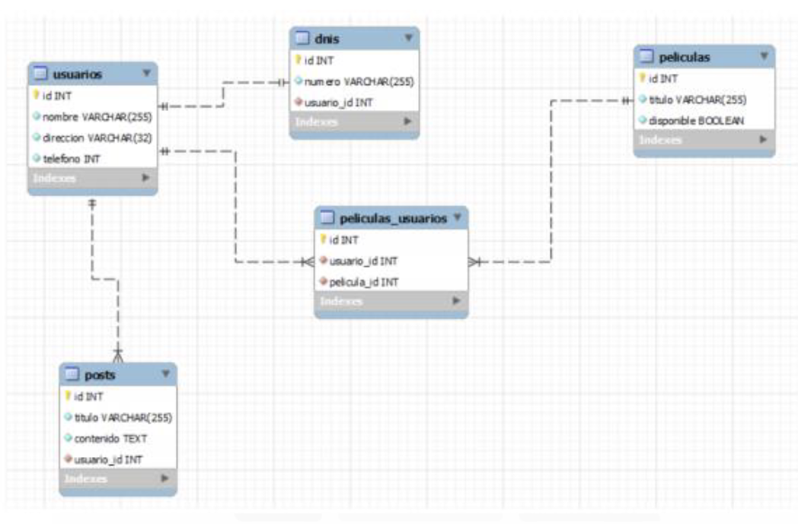
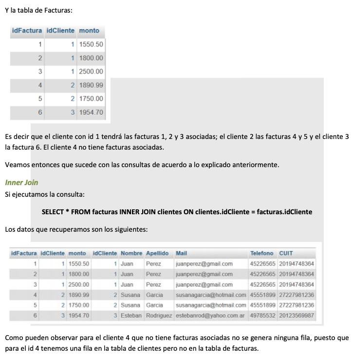
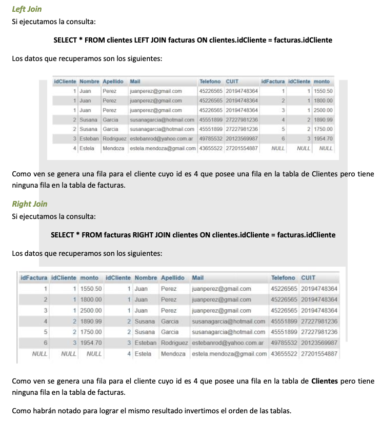

# Unidad 3
## CLAVES FORÁNEAS Y SUBCONSULTAS.
### Claves foráneas  
La  clave  primaria  de  una  tabla  SQL  es  la  que  me  sirve  para  identificar  de  manera  unívoca  un  registro.  Existen 
otro tipo de claves, denominadas claves foráneas, en inglés, foreign keys, que hacen referencia a una clave de 
otra tabla.

Pongamos un ejemplo supongamos que tenemos una tabla de Clientes.
El campo IdCliente es la PRIMARY KEY de la tabla Clientes.  

Y por otro lado tenemos una tabla de Facturas donde tenemos almacenadas todas las facturas de las compras 
realizadas por los clientes

El  campo  IdFactura  es  la  PRIMARY  KEY  de  la  tabla  Facturas.  Ahora  bien,  el  dato  IdCliente  está  haciendo  referencia al campo IdCliente de la tabla de Clientes.  

Y  por otro  lado  no  sería correcto  que  una  factura  en la  tabla  de  Facturas  tenga un  IdCliente  asociado  que  no  exista en la tabla de Clientes.  

Nosotros  tenemos  la  posibilidad,  en  este  caso,  de  indicarle  a  Mysql  estas  características  y  de  indicarle  como debe comportarse en cada situación.  

Las dos tablas las podemos graficar indicando una relación de 1 a muchos entre la tabla de Clientes y la tabla de Facturas

### Tipos de relaciones que podemos establecer entre tabals de nuestra base de datos 

**Entendiendo las relaciones en mysql** 
Qué mejor que ver todos los casos posibles de relaciones que se nos pueden dar para terminar de entenderlos de forma sencilla. 

**Relaciones de uno a uno**
Estas relaciones existen por ejemplo en el caso de una persona y su dni, una persona sólo puede tener un dni, y un dni sólo puede pertenecer a una persona. 

Para llevar a cabo esta relación en nuestra base de datos simplemente debemos crear nuestra tabla usuarios y nuestra tabla dnis

**Relaciones de uno a muchos** 
El ejemplo perfecto para estas relaciones es entre usuarios y posts de un blog, un usuario puede tener muchos  posts,  pero  un  post  sólo  puede  pertenecer  a  un  usuario,  sirve  lo  mismo  que  en  la  relación  de  uno  a  uno.  La única diferencia entre estas dos relaciones en este aspecto, es que la clave foránea entre usuarios y dnis puede estar tanto en la tabla usuarios con un campo id_dni como en la tabla dnis con un campo id_usuario.

**Relaciones de muchos a muchos  **
Este  tipo  de  relaciones  vienen  a  ser  las  más  complicadas,  aunque  realmente  no  lo  son,  para  el  ejemplo podemos decir que la relación entre usuarios y películas (alquileres de un videoclub), un usuario puede alquilar muchas películas, y una película puede ser alquilada por muchos usuarios.  

Estas relaciones no pueden ser llevadas a cabo con simples claves foráneas ya que necesitaríamos una por cada registro,  cosa  completamente  inviable. Para este  tipo de relaciones debemos crear una tercera tabla, conocida como tabla pivote, que por convención su nombre suele ser usuarios_peliculas para nuestro caso, es decir, los nombres de las dos tablas separados por guiones.  

Estas  tablas  deben  contener  como  mínimo  dos  campos,  usuario_id  y  pelicula_id  que  harán  referencia  a  las claves primarias de sus respectivas tablas.  

La función de esta tabla es la de poder enlazar a los usuarios y las películas a través de sus claves primarias, es decir,  si  tenemos  un  usuario  con  id  1  y  una  película  con  id  120  en  sus  respectivas  tablas,  para  poder  unirlos, deberíamos  crear  un  nuevo  registro  en  la  tabla  usuarios_peliculas  con  esos  datos.  Para  tenerlo  más  claro, veamos un sencillo diagrama sobre las relaciones de las que hemos hablado y como debemos interpretarlas en nuestra base de datos. 

**Como definir las claves foráneas** 
Continuemos  con  el  ejemplo  que  habíamos  planteado  al  principio,  nuestras  tablas  de  Clientes  y  de  Facturas. 

Vamos a ver cómo hacemos para representar esto en MySQL, en la práctica, cuando definimos las tablas.

En primer lugar definimos las tablas como estamos acostumbrados, cada una con su clave primaria.   

Una  vez  que  tenemos  la  tabla  de  clientes  y  de  facturas  definidas  vamos  a  seleccionar  la  tabla  de  facturas  y vamos a ir a la solapa estructura.  

Allí vamos a ver la definición de la tabla y debajo hay un vínculo que se llama Vista de relaciones.  

Presionado ese vinculo vamos a ir a una pantalla en la caul podemos definir las restricciones de la CF

Para  poder  definir  una  clave  foránea,  ésta  debe  ser  clave  en  la  tabla  en  la  que  se  encuentra,  es  decir  que  el dato idCliente en la tabla de Facturas debería ser clave para poder definirlo como clave foránea de otra tabla.

Y en este caso no lo es. Es por eso que no me aparece habilitada la posibilidad de definirla como tal y me aparece la leyenda 

¡No se ha definido ningún índice! Cree uno más abajo.   

Para crear un índice presionamos en el vínculo que se ve debajo y lo creamos. En este caso vamos a definir un índice con el nombre cliente y del tipo INDEX en la columna Facturas.idCliente 

Ahora  si  nos  va  a  aparecer  habilitada  la  opción  para  seleccionar  a  que  columna  hace  referencia  la  columna idCliente  de  la  tabla  de  facturas.  Nosotros  le  vamos  a  decir  que  hace  referencia  a  la  columna  idCliente  de  la tabla de Clientes y automáticamente se habilitan dos opciones para indicarle como se tienen que comportar las tablas ante un DELETE o un UPDATE.

Las  restricciones  foreign  key  tienen  cláusulas  ON  DELETE  y  ON  UPDATE  que  le  indican  a  Mysql  como  se  debe comportar frente a las eliminaciones y modificaciones de las tablas referenciadas en la restricción.  

Las opciones posibles son:  
* RESTRICT
  Rechaza la operación de eliminación o actualización en la tabla padre.
* SET NULL
   Borra o actualiza el registro en la tabla padre y establece en NULL la o las columnas de clave foránea en  la  tabla  hija.  Esto  solamente  es  válido  si  las  columnas  de  clave  foránea  no  han  sido  definidas  como  NOT NULL. MySQL 5.0 soporta tanto ON DELETE SET NULL como ON UPDATE SET NULL. 
* NO ACTION  
  significa  ninguna  acción  en  el  sentido  de  que  un  intento  de  borrar  o  actualizar  un  valor  de  clave primaria  no  sera  permitido  si  en  la  tabla  referenciada  hay  una  valor  de  clave  foránea  relacionado.  En  MySQL 5.0, InnoDB rechaza la operación de eliminación o actualización en la tabla padre
* CASCADE
  Borra  o  actualiza  el  registro  en  la  tabla  padre  y  automáticamente  borra  o  actualiza  los  registros coincidentes  en  la  tabla  hija.  Tanto  ON  DELETE  CASCADE  como  ON  UPDATE  CASCADE  están  disponibles  en MySQL  5.0.  Entre  dos  tablas,  no  se  deberían  definir  varias  cláusulas  ON  UPDATE  CASCADE  que  actúen  en  la misma columna en la tabla padre o hija. 

NO ACTION y RESTRICT son similares en tanto omiten la cláusula ON DELETE u ON UPDATE. (Algunos sistemas de bases de datos tienen verificaciones diferidas o retrasadas, una de las cuales es NO ACTION. En MySQL, las restricciones de claves foráneas se verifican inmediatamente, por eso, NO ACTION y RESTRICT son equivalentes.) 

Una cosa a tener en cuenta es que se puede definir una restricción en para el DELETE y otra para el UPDATE, es decir  puedo  definir  una  restricción  de  clave  foránea  con  la  cláusula  ON  DELETE  NO  ACTION  y  ON  UPDATE CASCADE. Si bien no es lo más habitual está permitido.

Pueden  hacer  la  prueba  de  ir  definiendo  las  restricciones  con  distintos  valores  e  ir  corroborando  el  resultado esperado.  

Por ejemplo pueden definir el cliente 5 con 3 facturas asociadas y teniendo la cláusula ON DELETE CASCADE, al intentar borrar el cliente 5 de la tabla de clientes debería borrarle las tres filas de la tabla de facturas asociadas a ese cliente.  

En cambio, la misma operación, ante una clausula ON DELETE NO ACTION no tendría que permitirles el DELETE sobre la tabla de clientes porque ese cliente tiene facturas asociadas.

### Join
El Join es  utilizado para listar datos que  pertenecen a dos tablas diferentes. En nuestro ejemplo, supongamos que yo quisiera listar todas las facturas con los datos de los clientes. Si tomo los datos de la tabla de facturas, allí  tengo  el  dato  del  idCliente,  pero  en  mi  listado  quiero  mostrar  el  Nombre  y  Apellido  del  cliente  con  el idFactura  y  el monto.  En  ese  caso  tendría  que  tomar  los  datos  de  ambas tablas.  Y  hay  un  dato  que  es  el que actúa como nexo entre ambas, el idCliente.

#### Los 3 tipos de Join mas comunes son: 
* INNER JOIN:  
  Devuelve todas las filas que  con una coincidencia en ambas tablas.  Si hay un dato que está en una de las tablas pero no en la otra esa fila no es listada.  En nuestro ejemplo, tengo los clientes con idCliente es 1, 2, 3, 4 y 5 en la tabla de Clientes y tengo facturas en la tabla de Facturas asociadas a los clientes 1, 2 y 3, para los clientes 4 y 5 no se listará ninguna fila.  
* LEFT JOIN:  
 El  LEFT  JOIN  se  diferencia  del  INNER  JOIN  en  que  si  los  datos  de  la  tabla  de  la  izquierda  no  se encuentran presentes en la tabla de la derecha se generará una fila con los valores correspondientes a la tabla de la derecha en NULL y los datos correspondientes a la tabla de la izquierda.  
* RIGHT JOIN:  
 El RIGHT JOIN es igual al LEFT JOIN pero en el sentido inverso. Si los datos de la tabla de la derecha no se encuentran presentes en la tabla de la izquierda se generará una fila con los valores correspondientes  a  la  tabla  de  la  izquierda  en  NULL  y  los  datos  correspondientes  a  la  tabla  de  la derecha

### Subconsultas
Una  subconsulta  es  una  sentencia  SELECT  que  aparece  dentro  de  otra  sentencia  SELECT  que  llamaremos consulta principal.  

Se  puede  encontrar  en  la  lista  de  selección,  en  la  cláusula  WHERE  o  en  la  cláusula  HAVING  de  la  consulta 
principal.

Una subconsulta tiene la misma sintaxis que una sentencia SELECT normal exceptuando que aparece encerrada entre paréntesis, no puede contener la cláusula ORDER BY, ni puede ser la UNION de varias sentencias SELECT. 

Se suelen utilizar, entre otras cosas, junto a las funciones agregadas que vimos anteriormente MIN, MAX, SUM, AVG, etc.

He  aquí  un  ejemplo  de  una  comparación  común  de  subconsultas  que  no  puede  hacerse  mediante  un  join. 
Encuentra todos los valores en la tabla t1 que son iguales a un valor máximo en la tabla t2:  
* SELECT column1 FROM t1 WHERE column1 = (SELECT MAX(column2) FROM t2); 
* 
Traslademos  esto  al  ejemplo  con  el  que  veníamos  trabajando.  Para  eso  vamos  a  modificar  el  monto  de  la factura con id 5 que corresponde al cliente 2 con el valor 2500. Entonces los datos de nuestra tabla serán estos:  Si ejecutamos la siguiente sentencia:  
* SELECT * FROM facturas WHERE monto = ( SELECT MAX( monto ) FROM facturas ) 

Las subconsultas también pueden utilizarse con las palabras ANY, IN y ALL. 

### Ejemplo
* SELECT s1 FROM t1 WHERE s1 IN (SELECT s1 FROM t2); 
  
Pensando en nuestro ejemplo podriamos listar todos los clientes que tengan facturas con la siguiente sentencia:  

* SELECT * FROM clientes WHERE clientes.idCliente IN (SELECT idCliente FROM facturas) 

Eso nos dará como resultado los clientes 1, 2 y 3.  En cambio si ejecutamos la siguiente sentencia:  
* SELECT * FROM clientes WHERE clientes.idCliente NOT IN (SELECT idCliente FROM facturas) 
  
Obtendremos como resultado el cliente 4.  

Para profundizar más en el tema de las subconsultas les sugiero que recurran al manual de MYsql: 
* http://dev.mysql.com/doc/refman/5.7/en/subqueries.html  