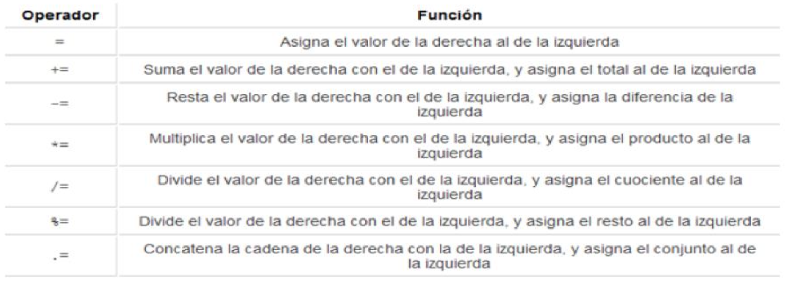
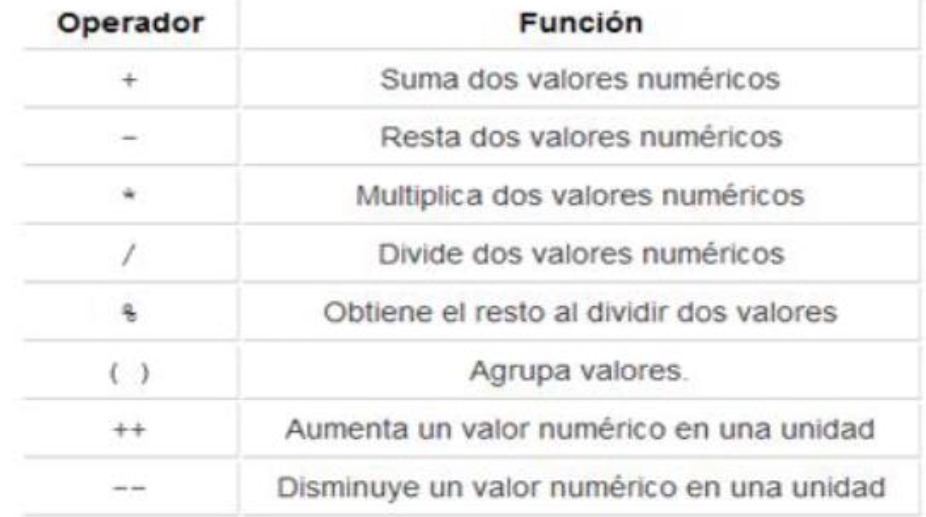
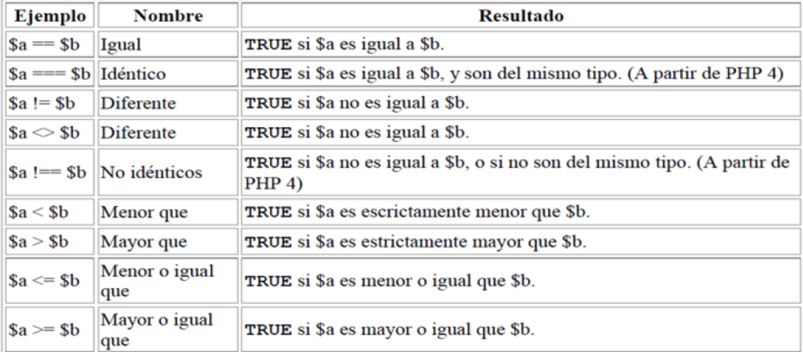
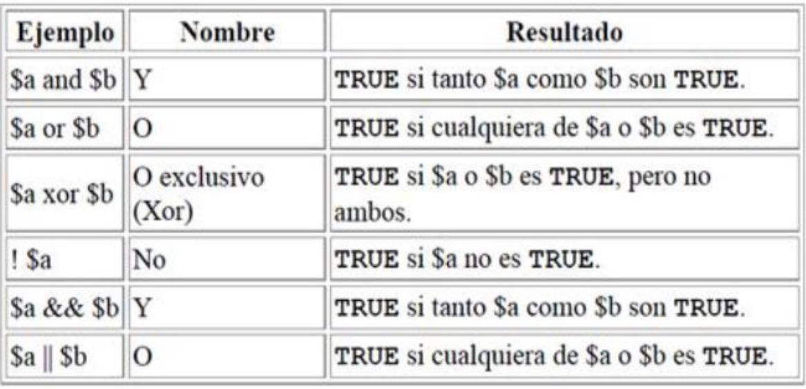

# Unidad 4
- Variables de sistema en PHP 
- Constantes
- Operadores

## Variables 
Las variables son elementos en programación que almacenan información con un nombre y un tipo de datos asociado. En PHP, estas variables son espacios de memoria en el servidor que almacenan valores y se identifican por un nombre y un tipo de datos (como enteros, reales, cadenas, arrays u objetos).

No es necesario declarar explícitamente el tipo de datos de una variable en PHP, ya que el intérprete lo detecta automáticamente en función de su contenido. Además, PHP puede realizar conversiones de tipo de datos según el contexto.

Las variables en PHP se representan con un signo de dólar ($) seguido de su nombre, y son sensibles a mayúsculas y minúsculas. Los nombres de variables deben comenzar con una letra o un guion bajo (_) y pueden seguir con letras, números o guiones bajos.

Las variables se utilizan para almacenar información que se usará en diversas partes del código de una página. Son fundamentales en la programación y permiten realizar cálculos y manipular datos de manera eficiente.

### Ejemplos 
```php
<?php
                    /* Caso 1 */
$Cadena = "Hola Mundo"; //Asignación de una variable tipo string

En el CASO 1 vemos un ejemplo simple de asignación de una variable con el operador de asignación =.

                   /* Caso 2 */
echo $Cadena."<br/>"; //Muestra por pantalla el valor de $Cadena

En el CASO 2, vemos un ejemplo de uso de la instrucción echo con una variable en vez de texto y otra cosa a destacar: concatenación de variables.

                 /* Caso 3 */
$NumeroUno = 1; //Asignación de una variable de tipo int.

En el CASO 3 se muestra un ejemplo de asignación de un número entero a una variable.

                 /* Caso 4 */
$NumeroDos = "2"; //Asignación de una variable tipo string.
En el CASO 4 se muestra un ejemplo de asignación de una cadena te texto a una variable

                 /* Caso 5 */
echo $NumeroUno + $NumeroDos; //Muestra por pantalla '3'.
                 /* Caso 6 */
echo $NumeroDos + $Cadena; //Muestra por pantalla '2', no realiza la suma. ?>

El CASO 5 y el CASO 6 muestran que el intérprete de PHP se da cuenta de cuándo puede operar entre números y strings y cuándo no.
```

### Tipos de datos que guardan las variables
PHP soporta ocho tipos primitivos.

Cuatro tipos escalares o simples:
- boolean (boleano)
- integer (entero)
- float (número de punto-flotante, también conocido como 'double o doble')
- string (cadena de caracteres)
  
Dos tipos compuestos:
- array (arreglos o vectores)
- object (objetos)

Dos tipos especiales:
- resource (recurso)
- NULL (nulo)

```php
<?php
$bool = TRUE; // un valor booleano
$str = "foo"; // una cadena
$int = 12; // un entero
echo gettype($bool); // imprime "boolean" 
echo gettype($str); // imprime "string" 
echo gettype($int); // imprime "integer"
setType($variable,"nuevo_tipo"); // permite cambiar el tipo de dato de una variable. ?>
```
#### Función setType()
La función setType() actualiza el tipo de $variable a "nuevo_tipo" y devuelve un boleano indicando si hubo éxito o no en la conversión

Entre "nuevo_tipo" tenemos:
- "integer"
- "double"
- "string"
- "array"
- "object"

También podemos hacer que una variable se comporte como un tipo determinado forzándola, de la misma manera a como se hace en el lenguaje C.
```php
$variable = "23";
$variable = (int) $variable;
```
Los forzados permitidos son:
- (int), (integer) - fuerza a entero (integer)
- (real), (double), (float) - fuerza a doble (double)
- (string) - fuerza a cadena (string)
- (array) - fuerza a array (array)
- (object) - fuerza a objeto (object)

### **Booleanos**:
Este es el tipo más simple. Un boolean expresa un valor de verdad. Puede ser TRUE or FALSE (verdadero o falso).

Para especificar un literal booleano, use alguna de las palabras clave TRUE o FALSE.
```php
<?php
$foo = True; // asignar el valor TRUE a $foo 
?>
```

### Enteros
Un integer o entero, es un número del conjunto Z = {..., -2, -1, 0, 1, 2, ...}.
```php
<?php
$a = 1234; // numero decimal
$a = -123; // un numero negativo
$a = 0123; // numero octal (equivalente al 83 decimal)
$a = 0x1A; // numero hexadecimal (equivalente al 26 decimal) 
?>
```
### Cadenas
Un valor string es una serie de caracteres. En PHP, un caracter es lo mismo que un byte, es decir, hay exactamente 256 tipos de caracteres diferentes

Un literal de cadena puede especificarse en tres formas diferentes.
- comillas simples
- comillas dobles
- sintaxis heredoc

#### Simples
Para especificar una comilla sencilla literal, necesita escaparla con una barra invertida (\),
```php
<?php
echo 'esta es una cadena simple';
echo 'También puede tener saltos de línea embebidos en las cadenas de esta forma, ya que es válido';
Programación Web con PHP y MySQL/ Nivel 2 – Unidad 3
echo 'Arnold dijo una vez: "I\'ll be back"';
// Imprime: Arnold dijo una vez: "I'll be back"
echo 'Ha
// Imprime: Ha eliminado C:\*.*?
echo 'Ha eliminado C:\*.*?';
// Imprime: Ha eliminado C:\*.*?
echo 'Esto no va a expandirse: \n una nueva línea';
eliminado
C:\\*.*?';
// Imprime: Esto no va a expandirse: \n una nueva línea
echo 'Las variables no se $expanden $tampoco';
// Imprime: Las variables no se $expanden $tampoco
?>
```

#### Dobles
Si la cadena se encuentra rodeada de comillas dobles (")
```php
<?php
$ahora="ahora";
$expanden="expanden";
echo "Las variables $ahora si se // Imprime: Las variables ahora si se expanden
?>
```

#### Heredoc
Otra forma de delimitar cadenas es mediante el uso de la sintaxis heredoc ("<<<"). Debe indicarse un identificador después de la secuencia <<<, luego la cadena, y luego el mismo identificador para cerrar la cita.

```PHP

<?php
$cadena = <<<FIN
Ejemplo de una cadena
que se extiende por varias líneas usando la sintaxis heredoc.
FIN;
?>
```
## Variables de Sistema en PHP

En PHP, se pueden acceder a una serie de variables de sistema que proporcionan información valiosa sobre el servidor y el cliente. Estas son algunas de las más importantes:

1. `$HTTP_USER_AGENT`: Proporciona información sobre el sistema operativo y el navegador del usuario. Puede utilizarse para redirigir a los usuarios a páginas optimizadas para su navegador.

2. `$HTTP_ACCEPT_LANGUAGE`: Devuelve la(s) lengua(s) principal(es) configurada(s) en el navegador del usuario. Útil para dirigir a los usuarios a páginas en su lengua preferida.

3. `$HTTP_REFERER`: Indica la URL desde la cual el usuario accedió a la página. Útil para generar botones "Atrás" dinámicos y para rastrear estadísticas de visitas.

4. `$PHP_SELF`: Devuelve la URL del script en ejecución. Útil para crear botones de recarga de página.

5. `$HTTP_GET_VARS`: Un array que almacena las variables enviadas al script a través de la URL o formularios GET.

6. `$HTTP_POST_VARS`: Un array que almacena las variables enviadas al script a través de formularios POST.

7. `$HTTP_COOKIES_VARS`: Un array que almacena las cookies.

8. `$PHP_AUTH_USER`: Almacena el nombre de usuario cuando se accede a páginas de acceso restringido. Útil para el control de acceso.

9. `$PHP_AUTH_PW`: Almacena la contraseña cuando se accede a páginas de acceso restringido. Complementa a `$PHP_AUTH_USER` para el control de acceso.

10. `$REMOTE_ADDR`: Muestra la dirección IP del visitante.

11. `$DOCUMENT_ROOT`: Devuelve la ruta física en la que se encuentra alojada la página en el servidor.

12. `$PHPSESSID`: Guarda el identificador de sesión del usuario (para el uso de sesiones).

Ten en cuenta que no todas estas variables están disponibles en todos los servidores ni en todas las versiones de PHP. Además, algunas de ellas solo se definen después de ciertos eventos, como `$HTTP_REFERER`, que solo se define cuando un usuario accede al script desde otro enlace.

## Variables Superglobales en PHP

A partir de PHP 4.1.0, se introdujo un conjunto de variables de tipo array llamadas "superglobales". Estas variables mantienen información del sistema y están disponibles de manera global en el script. Reemplazaron a las antiguas matrices que se accedían mediante $HTTP_*_VARS. A partir de PHP 5.0.0, estas matrices antiguas se pueden desactivar mediante la directiva `register_long_arrays`.

### Lista de Variables Superglobales Importantes

1. **$GLOBALS**: Contiene una referencia a todas las variables globales disponibles en el script.

2. **$_SERVER**: Almacena variables relacionadas con el servidor web y el entorno en el que se ejecuta el script. Equivalente a la antigua matriz $HTTP_SERVER_VARS.

3. **$_GET**: Contiene variables proporcionadas al script a través de solicitudes HTTP GET. Equivalente a $HTTP_GET_VARS.

4. **$_POST**: Contiene variables proporcionadas al script a través de solicitudes HTTP POST. Equivalente a $HTTP_POST_VARS.

5. **$_COOKIE**: Almacena variables proporcionadas al script a través de cookies HTTP. Equivalente a $HTTP_COOKIE_VARS.

6. **$_FILES**: Contiene variables relacionadas con la subida de archivos a través de solicitudes HTTP. Equivalente a $HTTP_POST_FILES.

7. **$_ENV**: Almacena variables proporcionadas al script a través del entorno del servidor. Equivalente a $HTTP_ENV_VARS.

8. **$_REQUEST**: Contiene variables proporcionadas al script a través de cualquier mecanismo de entrada del usuario. No se debe confiar completamente en ellas. La presencia y el orden de estas variables están definidos por la directiva de configuración `variables_order`.

9. **$_SESSION**: Contiene variables registradas en la sesión del script. Equivalente a $HTTP_SESSION_VARS.

Estas variables superglobales son útiles para acceder a datos del sistema y del cliente en cualquier parte del script de PHP.

### **Constantes en PHP**

Las constantes en PHP son identificadores que representan valores fijos y no cambian durante la ejecución del script. Aquí tienes lo más importante sobre las constantes:

- Se definen usando `define()` y no pueden modificarse ni eliminarse una vez definidas.
- Sus nombres son sensibles a mayúsculas y suelen escribirse en mayúsculas por convención.
- El nombre de una constante debe comenzar con una letra o guion bajo, seguido de letras, números o guiones bajos.
- Tienen alcance global y se pueden acceder desde cualquier parte del script.
- Solo pueden contener valores escalares como booleanos, enteros, números de punto flotante o cadenas.
- Para obtener el valor de una constante, se utiliza su nombre sin el prefijo `$`, o puedes usar `constant()` para expresarla de forma dinámica.
- Puedes verificar si una constante está definida usando `defined()`.

**Ejemplo:**

```php
define("CONSTANTE", "Hola Mundo.");
echo CONSTANTE; // Muestra "Hola Mundo."

// Esto mostrará "Constante" y generará un aviso del sistema.
echo Constante;
```

## Operadores
### Operadores de asignacion 

```php
<?php $a = 3;
$a += 5; // define $a como 8, como si hubiésemos dicho: $a = $a + 5;
$b = "Hola ";
$b .= "a todos!"; // define $b como "Hola a todos!", tal como $b = $b . "a todos!"; 
?>
```
### Operadores aritmrticos

```php
<?php
$calculo1=12/4; // 12/4=3 $calculo2=3*2; // 3*2=6 $calculo3=20%3; // 20/3=6, resto=2 echo $calculo1+$calculo2-$calculo3; ?>
<?php
$numero=24;
echo $numero."<br/>";
echo $numero++; // Lo muestra primero y luego lo incrementa, por ello es 24 echo "<br/>";
echo $numero; // Volvemos a mostrarlo y ya vale 25
echo "<br/>";
echo $numero--; // Lo muestra primero y luego lo decrementa, por ello es 25 echo "<br/>";
echo $numero; // Volvemos a mostrarlo y ya vale 24
echo "<br/>";
echo ++$numero; // Lo incrementa primero y luego lo muestra, por ello es 25 echo "<br/>";
echo --$numero; // Lo decrementa primero y luego lo muestra, por ello es 24 echo "<br/>";
```
### Operadores de comparacion

```php
<?php 
$a = 8; 
$b = 3;
$c = 3;
echo $a == $b,"<br>"; //imprime 1 porque es verdadero 
echo $a != $b,"<br>"; //imprime 1 porque es verdadero 
echo $a < $b,"<br>"; //imprime vacío “ “ porque es falso 
echo $a > $b,"<br>"; //imprime 1 porque es verdadero 
echo $a >= $c,"<br>"; //imprime 1 porque es verdadero 
echo $b <= $c,"<br>"; //imprime 1 porque es verdadero ?>
```
### Operadores Logicos 

